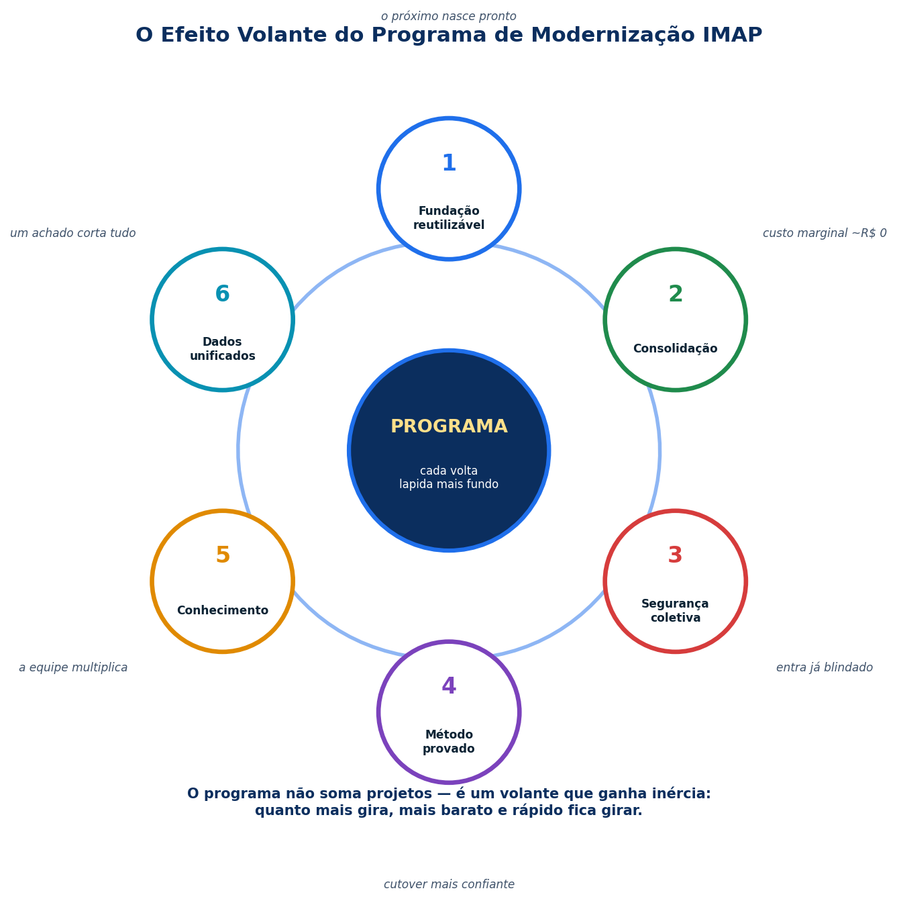

# O Pitch
## Enquanto a operação seguia normal, reconstruímos a fundação inteira.

> Este documento existe para contar, de uma vez, o que já aconteceu:
> **os sistemas mais críticos do IMAP foram reescritos, endurecidos e colocados em produção** — saindo de uma base antiga e paga para uma base **moderna, blindada e gratuita**.
> Não é um plano. Não é uma promessa. **Está no ar agora.**

---

## 1. O desafio herdado

Quase tudo que o IMAP opera — nota fiscal, diário oficial, transparência, editoração — rodava sobre **duas tecnologias que chegaram ao fim do ciclo de vida**:

- **Adobe ColdFusion 11** — sem correção de segurança há **~6 anos**, licença cara, mercado de profissionais cada vez mais restrito.
- **Windows Server 2012 R2** — **sem atualizações desde 2023**, licença + CALs recorrentes.

Emitir nota fiscal, publicar atos com valor legal e tratar dados de cidadãos exige uma base **mantida, segura e auditável** — e foi exatamente isso que o programa construiu.

## 2. A revelação

**Esse desafio já foi enfrentado — e superado, frente a frente.**

Sem parar a operação, sem big-bang e sem risco para o cidadão, **6 sistemas foram reconstruídos e estão em produção** sobre .NET 10, Python/FastAPI, React, Docker e Oracle Linux — com WAF, SIEM e TLS automático que o legado **nunca teve**.

## 3. A parede de provas — tudo verificável, tudo no ar

| Prova | Número |
|---|---|
| Frentes modernizadas **em produção** | **6** |
| Requisições reais comparadas legado × novo (SAI3) | **640 → 0 incompatibilidades** |
| Domínios do Diário Oficial numa só plataforma | **+470** |
| Portais de transparência servidos | **~400** |
| Domínios com HTTPS automático | **~400** |
| Clientes do Diário Inteligente já processados | **637** |
| Testes automatizados que **bloqueiam o deploy** | **49 (NFS-e) + 52 (SIEJ) + ~210 rotas (Cypress)** |
| Sistemas consolidados **num único host** Docker | **15** |
| Custo de licença da nova stack | **R$ 0** |
| Suporte da nova base (Oracle Linux 9) | **até 2032** |
| Interrupção para o cidadão durante a migração | **zero** |

## 4. Os cinco ganhos decisivos

1. **💸 Custo — cortado pela raiz.** Sai Adobe ColdFusion, sai Windows Server + CALs, saem componentes proprietários. Entra open-source: **licença R$ 0, para sempre**. Runtimes mais leves + 15 sistemas num host = **menos nuvem na fatura** — que **já caiu ~29% em 12 meses**. A única sobretaxa de licença restante (~1/5 da fatura de nuvem) **zera com a frente de Infraestrutura**, e otimizações de armazenamento em andamento projetam **nova redução expressiva**.
2. **🛡️ Segurança — décadas de atraso resolvidas de uma vez.** WAF (ModSecurity/OWASP) na borda, SIEM (Wazuh) vigiando, SELinux no kernel, TLS renovando sozinho em ~400 domínios, fail2ban, JWT, segredos protegidos. **Defesa em profundidade onde antes não havia nenhuma.**
3. **⚖️ LGPD — conformidade fortalecida.** A base modernizada é **suportada, monitorada e auditável**, com **trilha de evidências** — exatamente o que a defesa de "medidas de segurança adequadas" da LGPD pede.
4. **👥 Pessoas — liberdade de contratação.** De um mercado ColdFusion cada vez mais restrito para **as stacks mais contratáveis do planeta** (Python, .NET, React, TypeScript). Contratar, treinar e substituir ficou simples.
5. **🧭 Futuro — pavimentado e provado.** Cada sistema novo herda a fundação pronta (contêineres, segurança, CI): **nasce mais rápido e mais barato**. NFS-e Nacional pronta antes da obrigatoriedade, IA/voz no Diário, portão de fidelidade — coisas que o legado **jamais** entregaria.

## 5. E o método é tão valioso quanto o resultado

Nada foi apostado — **tudo foi provado antes de virar a chave**:

- O novo lê **o mesmo banco**, roda **lado a lado** com o legado, e o rollback leva **minutos**.
- Validação **pixel a pixel** (DIOF), *golden test* do XML fiscal (NFS-e), paridade de relatórios (SIEJ), **640 requisições comparadas** (SAI3).
- Cutover **gradual** — por cliente, por município, por tipo de órgão. Se algo falha, ninguém percebe. Nada falhou.

> Este método agora é um **ativo da empresa**: qualquer sistema futuro entra na mesma esteira.

## 6. O efeito volante — por que cada passo acelera o próximo

O programa **não soma projetos — ele multiplica**. Cada frente entregue devolve energia para todas as outras, e o volante ganha inércia a cada volta:

1. **🏗️ Fundação reutilizável** — cada sistema engrossa a plataforma comum (contêineres, CI, autenticação); o próximo **nasce pronto**. SGF e SGC já nasceram sobre a base do SIEJ.
2. **💸 Consolidação** — cada sistema entra no host compartilhado com **custo marginal perto de R$ 0**; cada peça legada aposentada **baixa a conta de todos**.
3. **🛡️ Segurança coletiva** — WAF, SIEM e SELinux protegem o host inteiro: um sistema novo entra **já blindado**, e cada endurecimento cobre **todos de uma vez**.
4. **✅ Método provado** — a régua de validação criada no SAI3 (640 requisições) é reusada em cada frente seguinte; cada cutover deixa o próximo **mais confiante**.
5. **👥 Conhecimento** — a equipe domina a stack **uma vez** e aplica em tudo; cada pessoa **multiplica o ritmo**.
6. **📊 Dados unificados** — mesmo banco, mesma telemetria: **um** painel cobre tudo, e **um** achado (como a otimização de armazenamento) corta custo do **parque inteiro**.

> **A leitura de negócio:** quanto mais o volante gira, **mais barato e rápido** fica girar. O ERP interno é a prova viva — hoje custa uma fração do que custaria se fosse o primeiro. **Cada volta lapida o diamante mais fundo.**

## 7. O que vem agora

A camada pública saiu do legado. As **duas peças de infraestrutura compartilhada** entram agora na mesma esteira — ambas com caminho de baixo atrito:

- **Banco:** SQL Server 2017 **já roda nativamente em Linux** — mesma engine, mesmos *stored procedures*, sem reescrita.
- **Arquivos:** migração para **SFTP/Object Storage** com **transferência cifrada de ponta a ponta** (a camada de acesso dos apps já foi modernizada; é repontar).

Concluídas essas duas, **o ciclo da fundação se encerra**: base unificada, zero licença desnecessária.

### E o ganho que a casa inteira percebe todos os dias: o ERP interno

O **ERP administrativo/financeiro** — o sistema que sustenta o dia a dia interno do Instituto — é **o sistema mais antigo do parque**, o último grande bloco da geração ColdFusion: evolução lenta, manutenção cara e conhecimento concentrado em poucas pessoas.

Ele tem duas metades, **já diagnosticadas linha a linha — e a renovação já começou**:

- **[SGF — Gestão Financeira](sgf/resumo-executivo-modernizacao.md)**: vendas, boletos, faturas, remessas bancárias e comissões — **207 páginas `.cfm`, ~49 mil linhas** a modernizar. É onde o dinheiro entra.
- **[SGC — Gestão de Clientes](sgc/resumo-executivo-modernizacao.md)**: clientes, contratos, propostas e atendimentos — **79 páginas `.cfm`** e um front de **356 arquivos de script** a reconstruir em componentes modernos.

Os serviços novos **já entraram no host Docker consolidado**, ao lado das demais frentes — herdando CI, autenticação e as camadas de segurança desde o primeiro dia.

**É exatamente para renová-lo que este programa importa:**

- **A fundação já está pronta** — contêineres, CI, autenticação, WAF/SIEM/SELinux e o host consolidado: o ERP novo **não começa do zero**, ele **herda tudo**.
- **O método já foi provado no pior caso** — o SIEJ tinha ~20 anos de legado e migrou **módulo a módulo, lendo o mesmo banco, com rollback** e sem parar um dia. **O ERP é o mesmo filme**, com roteiro já escrito.
- **Cada frente entregue barateia a próxima** — o custo de reconstruir o ERP **caiu a cada sistema entregue**, porque plataforma, esteira e equipe treinada já existem.
- **O retorno é diário e interno:** quem mais ganha com o ERP modernizado é **a própria equipe** — cada tela nova vira produtividade **dentro de casa**, todos os dias.

## 8. O pedido

1. **Aprovar o cutover gradual** das frentes já validadas (começando pelo SAI3, que provou 0 incompatibilidades).
2. **Aprovar a frente de Infraestrutura** — banco e arquivos para Linux, fechando o ciclo da fundação.
3. **Sustentar a renovação do ERP interno** — já iniciado (SGF + SGC), sobre a fundação e o método já provados.
4. **Dar visibilidade ao programa** — ele posiciona o IMAP como **referência em governo digital**.
5. **Incorporar ao planejamento estratégico** — modernização como **capacidade permanente** do Instituto, não projeto com data de fim.

### 🤝 Um programa de todos

A próxima fase precisa da **casa inteira** — e cada área tem um papel: a **operação** aponta o que atrapalha no dia a dia (cada tela renovada nasce desse feedback), o **desenvolvimento** migra módulos na esteira pronta, a **infraestrutura** conduz banco e arquivos, o **comercial** transforma os diferenciais em argumento com clientes, e a **gestão** garante o espaço no plano. **Quem quiser colaborar tem porta aberta** — o programa avança na velocidade da colaboração.

---

> ### Em uma frase
> **O IMAP trocou uma fundação antiga e paga por uma fundação moderna, protegida e gratuita — sem parar um único dia, com prova de cada passo — e agora tem método, plataforma e equipe para a próxima década.**
>
> O trabalho está feito. Falta só a decisão de colher tudo.

*Detalhes: **[Programa](PROGRAMA-MODERNIZACAO-IMAP.md)** · **[Por que sair do legado](POR-QUE-SAIR-DO-LEGADO.md)** · **[Tecnologias](TECNOLOGIAS.md)** · frentes nas pastas.*
