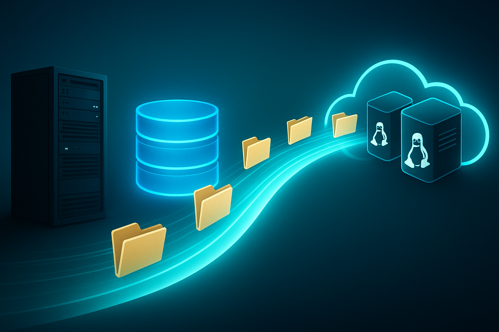

# Infraestrutura — Banco de Dados e Arquivos
> A **última fundação legada**: tirar o **SQL Server** e o **servidor de arquivos (FTP)** do **Windows** e levá-los para **Oracle Linux 9**.
> **Próxima frente do [Programa de Modernização IMAP](../PROGRAMA-MODERNIZACAO-IMAP.md).** Em planejamento.

---

## O que ainda está no legado

As aplicações já foram modernizadas (SAI3, DIOF, NFS-e, SIEJ…), mas duas peças de **infraestrutura compartilhada** ainda rodam sobre **Windows legado**:

| Componente | Hoje | Problema |
|---|---|---|
| **Banco de dados** | **SQL Server 2017** em **Windows Server** | SO legado; licenciamento; ponto único usado por todas as frentes |
| **Servidor de arquivos** | **FTP** em **Windows Server** (mídias, documentos, PDFs de atos oficiais) | SO legado; a modernização traz **transferência cifrada** e escalabilidade |

> Enquanto essas peças ficam no Windows, o programa **não fecha o ciclo** — sobra licença, sobra superfície de ataque e sobra dependência de um SO sem suporte.

---

## 🗄️ Migração do Banco de Dados (SQL Server → Oracle Linux 9)

**Fato que facilita tudo:** o banco já é **SQL Server 2017**, que **roda nativamente em Linux**. Ou seja, dá para sair do Windows **sem trocar de versão e sem reescrever** nada.

**Caminho, do menor ao maior ganho:**

1. **SQL Server em Linux (OL9)** — *menor atrito.* Mesma versão, **mesmos stored procedures**, mesma aplicação. **Elimina a licença de Windows Server + CALs** no host de banco. Mantém 100% de compatibilidade.

**Ganhos:** fim do Windows no host de banco · patches/segurança contínuos · consolidação · backups e HA modernos · **caminho para custo de licença R$ 0**.

---

## 📁 Migração do Servidor de Arquivos (FTP → Linux)

O servidor de arquivos serve mídias, documentos e **PDFs de atos oficiais**. Modernizá-lo tira mais uma peça do Windows legado e **eleva o padrão da transferência** — cifragem de ponta a ponta e integração direta com a stack em contêineres.

**Caminho:**

1. **SFTP / FTPS em Linux** — transferência **cifrada**, mesmo modelo de pastas, integra direto com os apps já em Linux.
2. **Armazenamento de objetos** (OCI Object Storage / S3-compatível) com **URLs assinadas** — escalável, com CDN e sem servidor de arquivos para manter.

**Ganhos:** fim do Windows · **transferência cifrada** (segurança/LGPD) · escalabilidade · integração natural com a stack em contêineres. *A camada de acesso a arquivos das aplicações já foi reescrita em biblioteca moderna (FluentFTP), então repontar para o novo destino é simples.*

---

## ✅ Benefícios comuns (valem para todas as frentes do programa)

> Detalhados no **[Programa](../PROGRAMA-MODERNIZACAO-IMAP.md)**.

- 💸 **Rumo à licença R$ 0** — fim do Windows Server no host de banco/arquivos; PostgreSQL e SFTP são open-source.
- 🛡️ **Fim de tecnologia sem suporte** — SO com patches contínuos.
- 🐋 **Linux + Oracle Cloud** — consolidação e integração com os sistemas já conteinerizados.
- 🔒 **Segurança em profundidade** — transferência cifrada, hardening (SELinux), superfície reduzida.
- ♻️ **Migração incremental e reversível** — réplica/espelho + cutover em janela + rollback.
- ✅ **Método já provado** — o mesmo padrão que validou as 6 frentes (mesma base, lado a lado, validação antes do cutover).

---

## 🔎 Aprofundamento — os 5 eixos

- **🚀 Modernização.** Tira as **duas últimas peças** (banco e arquivos) do Windows legado. Como o banco já é **SQL Server 2017** (roda **nativamente em Linux**), o primeiro passo é **de baixo atrito**: mesma versão, mesmos *stored procedures*, mesma aplicação — sem reescrita.
- **💸 Custos.** **Elimina a licença de Windows Server + CALs** no host de banco e no de arquivos. Abre o caminho para **PostgreSQL open-source (licença R$ 0)** no futuro; SFTP e Object Storage também são open-source.
- **🧱 Endurecimento (hardening).** Entra **SFTP/FTPS** ou **Object Storage com URLs assinadas**; host sob **SELinux** e **superfície reduzida**.
- **🛡️ Segurança & salvaguarda.** **Transferência cifrada de ponta a ponta** dos arquivos (mídias, documentos e **PDFs de atos oficiais**) — padrão de segurança/LGPD atual; SO com **patches contínuos**.
- **🧭 Futuro já pavimentado e provado.** É a frente que **fecha o ciclo** do programa. Usa o **mesmo método já validado** nas 6 frentes (réplica/espelho, lado a lado, validação antes do cutover) e a **mesma suíte** que comprovou o SAI3 (640 requisições) — encerra a licença e a superfície de risco que restam.

---

## ⚠️ Riscos e mitigação

| Risco | Mitigação |
|---|---|
| Diferenças de comportamento do banco | **SQL Server em Linux** mantém a mesma engine → sem risco de reescrita. Validação com a **mesma suíte usada no SAI3** (640 requisições). |
| Downtime na virada | Migração com **réplica/espelho**, cutover em janela e **rollback** para o Windows. |
| Repontar os apps para o novo FTP | Camada de arquivos já em biblioteca moderna → troca de destino simples. |

---

## 🗺️ Próximos passos (proposta)

1. **Provisionar SQL Server em Linux/contêiner (OL9)** e replicar o catálogo `SAI`.
2. **Validar** com a suíte de compatibilidade já existente (a mesma que comprovou o SAI3).
3. **Cutover do banco** em janela, com réplica e rollback.
4. **Subir SFTP / Object Storage** e **repontar** os apps (Handler de mídias/documentos).
5. **Desligar os hosts Windows legados** (banco e FTP) — encerrando o ciclo do programa.

---

## 🧰 Tecnologias

SQL Server (em Linux) · PostgreSQL (roadmap) · Docker · Oracle Linux 9 · OCI Object Storage · SFTP/FTPS — impacto de cada uma em **[TECNOLOGIAS.md](../TECNOLOGIAS.md)**.

---

> **Em resumo:** esta é a frente que **fecha o ciclo** da modernização — tira as duas últimas peças (banco e arquivos) do Windows legado, elimina o que resta de licença e superfície de risco, e abre caminho para um banco **open-source (licença R$ 0)** no futuro. O SQL Server já é 2017 (roda em Linux), então o primeiro passo é **de baixo atrito**.
