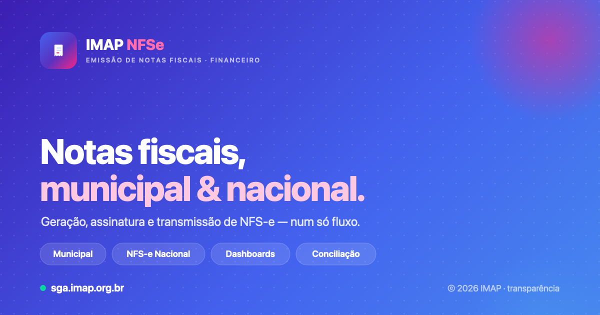

# IMAP NFS-e
> Módulo fiscal (Nota Fiscal de Serviço eletrônica).
> **De ColdFusion 11 → .NET 9 / Docker.** Em produção em `sga.imap.org.br`.
> *Uma frente do **[Programa de Modernização IMAP](../PROGRAMA-MODERNIZACAO-IMAP.md)**.*

---

## O que é

O núcleo fiscal que **emite e gerencia NFS-e**. Rodava em **ColdFusion 11** sobre **Windows Server 2012 R2** (ambos fora de suporte) — ou seja, emitindo nota fiscal sobre um servidor sem manutenção.

## De → Para

| Dimensão | Antes (legado) | Depois (entregue) |
|---|---|---|
| Plataforma | ColdFusion 11 (EOL) | **.NET 9 · open-source** |
| Sistema operacional | Windows Server 2012 R2 (EOL) | **Linux + Docker** |
| Licenciamento | CF + Windows (pago) | **R$ 0 (open-source)** |
| TLS/HTTPS | manual | **Let's Encrypt automático** |
| Gestão de segredos | prática legada | **segredos protegidos** |
| Testes automatizados | nenhum | **49**, com blindagem do XML fiscal |
| Entrega | manual | **CI + deploy conteinerizado** |
| NFS-e Nacional | inexistente | **pronta** (emissão + conciliação) |

## ✅ Benefícios comuns (valem para todas as frentes do programa)

> Detalhados no **[Programa](../PROGRAMA-MODERNIZACAO-IMAP.md)**.

- 💸 **Licença de software R$ 0** — .NET, Docker e Linux open-source.
- 🛡️ **Fim de tecnologia sem suporte** — base mantida e com patches.
- 🐋 **Linux + Docker + Oracle Cloud** — **consolidação real**: o serviço `imap-nfse` roda no host Docker de produção, junto de **outros 14 contêineres** (mais densidade, menos VMs).
- 🔒 **Segurança em profundidade** — WAF, SIEM (Wazuh), TLS automático, hardening (SELinux), segredos protegidos.
- ♻️ **Migração incremental e reversível** — lê o mesmo banco, roda lado a lado, rollback rápido.
- ✅ **Modernização provada** — 49 testes verdes a cada build, incluindo teste "golden" do XML fiscal.
- 👥 **Mão de obra abundante** — .NET é padrão de mercado.
- ⚙️ **Sem parar a operação.**

## ⭐ Benefícios específicos desta frente

- **🧾 NFS-e Nacional** (padrão federal SNNFSe) — montagem, validação, **assinatura digital**, transmissão de DPS, listagem via ADN e **conciliação local × nacional**. Prontos **antes** da obrigatoriedade.
- **🔏 Assinatura mTLS para o fisco** e validação na inicialização.
- **🧪 Blindagem do XML fiscal** — teste "golden" impede regressões no documento fiscal.
- **♿ Acessibilidade & UX** — formulários com rótulos, foco visível, contraste, layout responsivo.

## 🔎 Aprofundamento — os 5 eixos

- **🚀 Modernização.** Núcleo fiscal sai do ColdFusion 11 para **.NET 9** com **CI + deploy conteinerizado**. A **NFS-e Nacional** (padrão federal SNNFSe) já está **pronta** — emissão, assinatura digital, transmissão de DPS e conciliação local × nacional — **antes** da obrigatoriedade.
- **💸 Custos.** Fim da **licença ColdFusion + Windows Server + CALs**; .NET, Docker e Linux são **open-source (R$ 0)**. O serviço `imap-nfse` **compartilha o host Docker** com ~14 outros contêineres — consolidação real, menos VMs.
- **🧱 Endurecimento (hardening).** **Segredos protegidos**, **validação de configuração na inicialização** (o serviço não sobe malconfigurado) e **contêiner Linux sob SELinux** — o oposto da prática legada.
- **🛡️ Segurança & salvaguarda.** Emitir nota fiscal sobre um SO sem manutenção era o risco central. Agora: **TLS Let's Encrypt automático**, **assinatura mTLS com o fisco**, **WAF + SIEM (Wazuh)** e um **teste "golden" do XML fiscal** que **bloqueia o deploy** se o documento fiscal mudar. São **49 testes verdes a cada build**.
- **🧭 Futuro já pavimentado e provado.** **Em produção** em `sga.imap.org.br` com banco real conectado e health-check `ready`. A mesma fundação recebe os **módulos restantes** do ColdFusion — até desligar o Windows Server 2012 R2.

## 📍 Provas (em produção)

- Produção: **`https://sga.imap.org.br`** com TLS válido.
- **49 testes** verdes a cada build.
- Banco de produção conectado, health-check `ready` = OK.
- **Consolidação confirmada** — compartilha o host Docker com ~14 outros serviços.

## 🧰 Tecnologias

.NET 9 (C#) · Docker · Linux/OCI · Let's Encrypt · CI — impacto de cada uma em **[TECNOLOGIAS.md](../TECNOLOGIAS.md)**.

## 🗺️ Roadmap

1. **Migrar os módulos restantes** do ColdFusion com o mesmo modelo → desligar o Windows Server 2012 R2.
2. **Ativar a NFS-e Nacional** em produção (certificado + adesão).
3. **Auditoria de acessibilidade** formal (rumo a WCAG).
