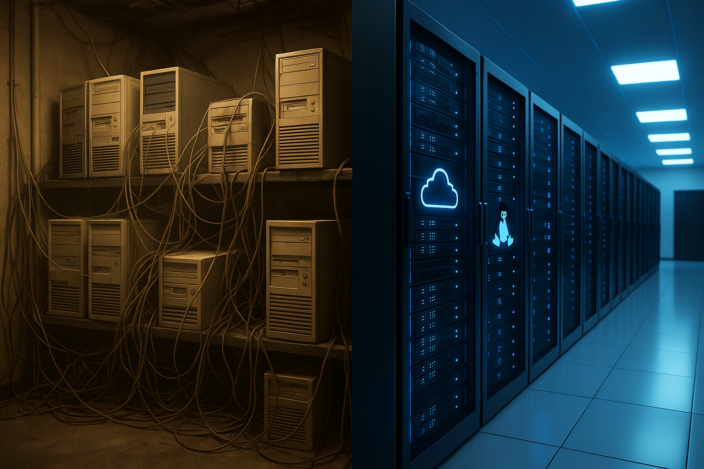
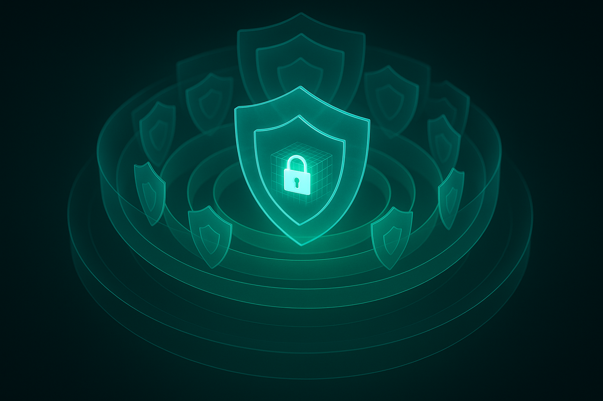
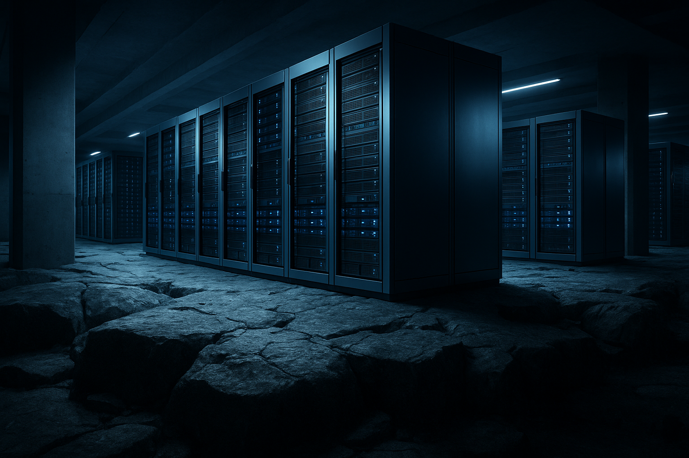

# Modernização do Portal da Transparência
## SAI2 → SAI3 · de .NET Framework 4.6.1 / IIS / Windows para **.NET 10 / Oracle Linux 9**

> **Documento único de apresentação** · Junho/2026 · *uma frente do [Programa de Modernização IMAP](../PROGRAMA-MODERNIZACAO-IMAP.md)*
> *Já está no ar. Já está testado. Já está seguro.*

---

## O ponto de partida

> **A aplicação do Portal já saiu do legado — mas a fundação compartilhada ainda não.**
> O backend rodava em **.NET Framework 4.6.1**, uma plataforma **descontinuada desde 2022**. E o **banco de dados principal** e o **servidor de arquivos (FTP)** ainda rodam sobre **Windows legado**.

A boa notícia: a parte mais crítica e arriscada — a **aplicação** — **já foi migrada** para .NET 10 / Oracle Linux 9, **no ar e comprovada**. Tiramos o maior pedaço do risco; o restante (banco e FTP) está no roadmap.

Não estamos propondo **assumir** um risco — estamos **removendo**, peça por peça, um risco que **já existe**.

---

## ✅ Os fatos principais

| | |
|---|---|
| 🔴 **Plataforma morta** | .NET Framework 4.6.1 **descontinuado desde 2022** — aplicação **já migrada** |
| 🟢 **Compatibilidade comprovada** | **640 requisições reais testadas** (2 municípios, dados reais) → **0 incompatibilidades** |
| 🟢 **Custo de licença ≈ R$ 0** | quase **toda** a nova stack é gratuita / open-source |
| 🟢 **Segurança reforçada** | camadas de segurança que o sistema **não tinha antes** |
| 🟢 **Reversível em minutos** | o legado continua intacto e no ar |
| 🟢 **Frontend não muda** | nada a reescrever — troca-se só a URL da API |

---

## 🔄 Antes × Depois

| Dimensão | ❌ SAI2 (legado) | ✅ SAI3 (novo) |
|---|---|---|
| Sistema operacional | **Windows / IIS** *(legado)* | **Oracle Linux 9** *(suporte até 2032)* |
| Plataforma | .NET Framework **4.6.1** *(fim 2022)* | **.NET 10** *(atual)* |
| Servidor | IIS | **Kestrel + Apache** |
| Licença de SO | 💸 paga | **gratuita** |
| WAF (firewall de aplicação) | limitado | **ModSecurity + OWASP CRS** |
| SIEM / monitoramento | — | **Wazuh** |
| Testes automatizados | nenhum | **suíte + validação contra o legado** |
| Portabilidade | só Windows | **multiplataforma / containers** |

---

## 💰 Custo de licença ≈ R$ 0

A nova stack é construída sobre tecnologia **gratuita e open-source** — o custo de **licenciamento** praticamente desaparece:

| Componente | Custo de licença |
|---|---|
| Sistema operacional (Oracle Linux 9) | **R$ 0** |
| Plataforma (.NET 10) | **R$ 0** |
| WAF (ModSecurity + OWASP CRS) | **R$ 0** |
| SIEM / monitoramento (Wazuh) | **R$ 0** |
| Bibliotecas (PDF, Excel, FTP… — todas open-source/MIT) | **R$ 0** |
| TLS / certificados (Let's Encrypt) | **R$ 0** |

**Além disso:**
- 🛑 **Fim do licenciamento Windows Server + CALs** na camada de aplicação.
- ⚡ **.NET 10 é muito mais eficiente** → mesma carga com **menos CPU/RAM** → infraestrutura mais enxuta.
- 🔓 **Saída de dependências comerciais** (ex.: iTextSharp) **para open-source** — menos contratos, menos lock-in.

> Em resumo: trocamos uma stack **paga** por uma **gratuita** — sem perder nada.

---

## 🛡️ Segurança em profundidade

Agora o sistema tem **defesa em profundidade** — várias barreiras independentes, todas **open-source**:

### 🧱 Na borda — WAF
**ModSecurity + OWASP Core Rule Set** protege contra os ataques do **OWASP Top 10** (SQL Injection, XSS, path traversal…). *Uma camada de proteção inteiramente nova.*

### 👁️ Detecção e resposta — Wazuh (SIEM/XDR)
- **Detecção de intrusão (HIDS)** e logs centralizados.
- **Monitoramento de integridade de arquivos (FIM)** — alerta se algo crítico for alterado.
- **Detecção de vulnerabilidades** e avaliação de configuração (benchmarks CIS).
- **Alertas em tempo quase real** e **relatórios de conformidade** (LGPD).

> Saímos de **"esperar dar problema"** para **detectar, alertar e provar**.

### 🔒 Na aplicação
- **CORS restrito (whitelist)** · **rate limiting** por IP · **JWT** · **segredos protegidos**.

### 🧰 No sistema operacional
- **SELinux em modo *enforcing*** (controle de acesso mandatório — inexistente no mundo Windows legado).
- **TLS automático** (renovação sem intervenção) · **superfície de ataque reduzida** · **patches contínuos**.

### 📋 Conformidade (LGPD)
O portal trata **dados de cidadãos e pedidos de e-SIC**. Operar sobre SO sem suporte é **indefensável em auditoria**. Agora temos um ambiente **suportado, monitorado e auditável**, com **trilha de evidências**.

---

## 🧩 As 12 vantagens (Software · Infra · Custos · Segurança)

| # | Eixo | Vantagem | ❌ Antes | ✅ Depois |
|---|---|---|---|---|
| 1 | Software | Plataforma suportada | .NET Fwk 4.6.1 (EOL) | **.NET 10** |
| 2 | Software | Código moderno/manutenção | verboso, legado | **C# moderno, enxuto** |
| 3 | Software | Dependências | comerciais | **open-source (MIT)** |
| 4 | Software | Qualidade comprovável | sem testes | **640 req. / 0 incompat.** |
| 5 | Infra | Sistema operacional | Windows / IIS (legado) | **Oracle Linux 9 (2032)** |
| 6 | Infra | Portabilidade | só Windows | **multiplataforma/cloud** |
| 7 | Infra | Operação/entrega | manual | **systemd + CI + TLS auto** |
| 8 | Custos | Licenciamento | Windows + CALs + libs pagas | **≈ R$ 0** |
| 9 | Custos | Eficiência | .NET Fwk pesado | **menos CPU/RAM** |
| 10 | Segurança | WAF + controles de app | inexistente | **ModSecurity/OWASP + CORS/rate/JWT** |
| 11 | Segurança | Monitoramento/hardening | inexistente | **Wazuh + SELinux** |
| 12 | Segurança | Conformidade (LGPD) | indefensável | **auditável + trilha de evidências** |

---

## ✅ Risco baixo — porque já está feito

- **Compatibilidade comprovada:** 640 requisições reais, 2 municípios, dados reais → **0 incompatibilidades**.
- **Frontend Angular não muda.**
- **Rollback em minutos** — o legado segue intacto e no ar.
- **Cutover gradual** por município — **sem big-bang**.

> Não é um experimento. É uma substituição **pronta, testada e reversível**.

---

## 🔧 Em andamento (as próximas frentes — já no radar)

A aplicação está modernizada. Agora avançamos sobre a **infraestrutura compartilhada** — com método, frente a frente:

- 🗄️ **Banco de dados (SQL Server):** ainda em **Windows legado** → migração em andamento *(SQL Server em Linux/containers → gerenciado → eventual open-source)*. **Não bloqueia** a aplicação já no ar.
- 📁 **Servidor de arquivos (FTP):** ainda em **Windows legado** → a modernizar.
- 🛠️ **Painel administrativo (MVC):** próxima fase — *lift* para ASP.NET Core.

> Não são "pendências" — é o **roadmap de uma operação que já está modernizando com método**.

---

## 🏛️ Uma fundação para a próxima década

Não é só apagar incêndio: é **construir base**. Stack atual e suportada **até 2032**, multiplataforma, segura por padrão e barata de operar — pronta para crescer (containers, cloud, novos módulos).

### Recomendação
1. **Aprovar o cutover gradual** da API pública para o SAI3.
2. **Consolidar o ambiente** (unificar instâncias/recursos duplicados numa única região que atende a todos).
3. **Planejar a fase 2** (banco de dados e painel administrativo).

---

> ### Em resumo
> A aplicação do Portal **já está em produção** na nova base, com **compatibilidade comprovada**, **segurança em profundidade** e **licença de software R$ 0**. A migração é **reversível** e o próximo passo (banco e FTP) já está no roadmap.
